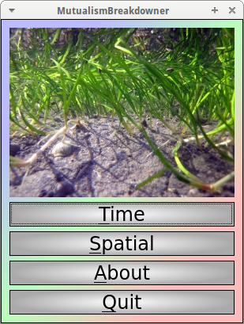
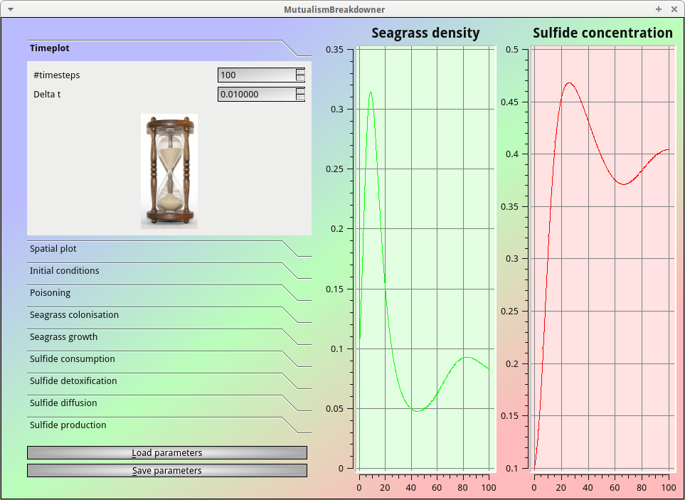
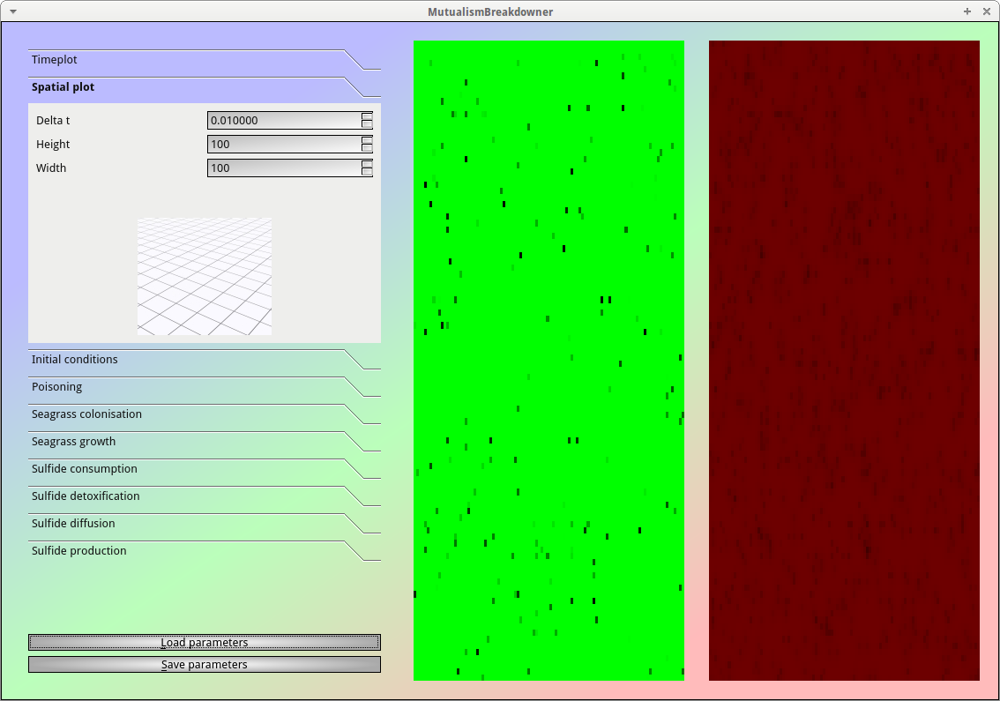

# MutualismBreakdowner

Branch |                                                                                                 |
-------|--------------------------------------------------------------------------------------------------------------------------------------------------------------|--------------------------------------------------------------------------------------------------------------------------------------------------------------------------------------------
master | |
develop||

C++ simulation (both non-spatial and spatial) of a possible mutalistic breakdown in seagrass using Qt.

## Downloads

 * Differential equations: [odt](doc/MutualismBreakdowner.odt) [pdf](doc/MutualismBreakdowner.pdf)
 * [Download the MutualismBreakdowner Windows executable](http://richelbilderbeek.nl/MutualismBreakdownerExe.zip)

## Videos

 * MutualismBreakdowner timeplot video: [YouTube](https://youtu.be/Nd7-sO1qmMs) [ogv](http://richelbilderbeek.nl/MutualismBreakdownerTimeplot.ogv)
 * MutualismBreakdowner spatial video: [YouTube](https://youtu.be/NwoaLe5XSiI) [ogv](http://richelbilderbeek.nl/MutualismBreakdownerSpatial.ogv)
